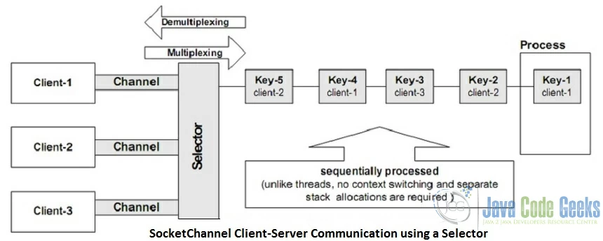

# java-nio-reactor-examples

## read this first the socket programming

[https://www.cs.bgu.ac.il/~spl201/index.php?page=Reactor]()

# blocked vs wait
this concept
blocking, meaning that control did not return to the calling thread until the invocation of the operation has terminated

```
The important difference between the blocked and wait states is the impact on the scheduler.
A thread in a blocked state is contending for a lock; that thread still counts as something
the scheduler needs to service, possibly getting factored into the scheduler's decisions about
how much time to give running threads (so that it can give the threads blocking on the lock a chance).

Once a thread is in the wait state the stress it puts on the system is minimized, 
and the scheduler doesn't have to worry about it. It goes dormant until it receives a notification.

Except for the fact that it keeps an OS thread occupied it is entirely out of play.

This is why using notifyAll is less than ideal, it causes a bunch of threads that were

previously happily dormant putting no load on the system to get woken up,

where most of them will block until they can acquire the lock, 
find the condition they are waiting for is not true, and go back to waiting. 
It would be preferable to notify only those threads that have a chance of making progress.

(Using ReentrantLock instead of intrinsic locks allows you to have multiple conditions for one lock, 
so that you can make sure the notified thread is one that's waiting on a particular condition, 
avoiding the lost-notification bug in the case of a thread getting notified for something it can't act on.)
```

# sleep vs wait
```
sleep() is a method which is used to pause the process for few seconds or the time we want to. 
But in case of wait() method, thread goes in waiting state and it won’t come back automatically until we call the notify() or notifyAll().

The major difference is that wait() releases the lock or monitor while sleep() doesn’t releases 
the lock or monitor while waiting. wait() is used for inter-thread communication while sleep() is used to introduce pause on execution, generally.
```


https://howtodoinjava.com/java/multi-threading/sleep-vs-wait/




https://medium.com/coderscorner/tale-of-client-server-and-socket-a6ef54a74763

https://examples.javacodegeeks.com/core-java/nio/java-nio-socket-example/


**http://jeewanthad.blogspot.com/2013/02/reactor-pattern-explained-part-1.html**

There are two important participants in the architecture of Reactor
Pattern.

1. Reactor

A Reactor runs in a separate thread and its job is to react to IO events
by dispatching the work to the appropriate handler. Its like a telephone
operator in a company who answers the calls from clients and transfers
the communication line to the appropriate receiver. Don't go too far
with the analogy though :).

2. Handlers

A Handler performs the actual work to be done with an IO event similar
to the actual officer in the company the client who called wants to
speak to.

Since we are using java.nio package, its important to understand some of
the classes used to implement the system. I will simply repeat some of
the explanations by Doug Lea in his lecture sides to make the readers
lives easy :).

3. Channels

These are connections to files, sockets etc. that support non blocking
reads. Just like many TV channels can be watched from one physical
connection to the antena, many java.nio.channels.SocketChannels
corresponding to each client can be made from a single
java.nio.channels.ServerSocketChannel which is bound to a single port.

4. Buffers

Array-like objects that can be directly read or written to by Channels.

5. Selectors

Selectors tell which of a set of Channels has IO events.

6. Selection Keys

Selection Keys maintain IO event status and bindings. Its a
representation of the relationship between a Selector and a Channel. By
looking at the Selection Key given by the Selector, the Reactor can
decide what to do with the IO event which occurs on the Channel.


```json5
Server thread: main Server started...
server interest OP_ACCEPT
server blocking/wait on client connect event
Client started! connect to server 8090...
Client started! connect to server 8090...
Server connected to client: /127.0.0.1:64557
Selector interest OP_READ
server blocking/wait on client connect event
Server connected to client: /127.0.0.1:64558
Selector interest OP_READ
server blocking/wait on client connect event
client-A: client msg test1
client-B: client msg test1
Got: client-A: client msg test1
server blocking/wait on client connect event
Got: client-B: client msg test1
server blocking/wait on client connect event
client-A:client msg test2
client-B:client msg test2
Got: client-A:client msg test2
server blocking/wait on client connect event
Got: client-B:client msg test2
server blocking/wait on client connect event
client-B: client msg test3
client-A: client msg test3
Got: client-B: client msg test3
Got: client-A: client msg test3
server blocking/wait on client connect event
Connection closed by client: /127.0.0.1:64557
server blocking/wait on client connect event
Connection closed by client: /127.0.0.1:64558
server blocking/wait on client connect event
```

# asynchronous vs non-blocking
https://stackoverflow.com/questions/2625493/asynchronous-vs-non-blocking#:~:text=Non%2Dblocking%20means%20that%20if,error%20and%20does%20nothing%20else.&text=Asynchronous%20means%20that%20the%20API,way%20to%20obtain%20the%20result.